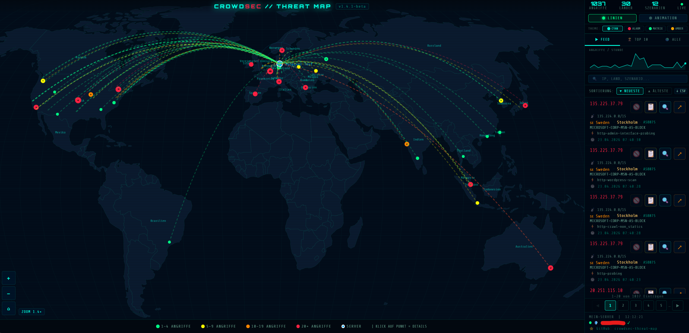

<div align="center">


# SelfThreatMap

**Live attack map straight from your local CrowdSec database**
**Live-Angriffskarte direkt aus deiner lokalen CrowdSec-Datenbank**

[](CHANGELOG.md)
[](LICENSE)
[](#-installation)
[](crowdsec_exporter.py)
[](https://github.com/s3lfcod3r/selfthreatmap/pkgs/container/selfthreatmap)

*Part of the **Self** suite of self-hosted tools · Teil der **Self**-Suite*



</div>

---

🇬🇧 **English** · [🇩🇪 Deutsch unten](#-deutsch)

## ✨ Features

- 🌍 **Interactive world map** with animated attack paths (D3.js) — all attack points visible on load
- 🚀 **30+ flight-path styles** — rocket (default), comet, laser, particle stream, arcs, impact rings & more, switchable in settings
- 🎛️ **50+ one-click profiles** — top dropdown presets that bundle style + theme + animation + density + mode (e.g. "All attacks (console)", "Static heatmap", "Comet rain", "Matrix mode", "Brute-force hunt"); your pick is **remembered across reloads**
- 🗺️ **Attack-origins views** — click "Countries" for a ranked list of every country (+ top cities) you've been attacked from, **and** the "ORIGINS" map toggle plots every origin as a point; labels are collision-free (country names when zoomed out, city names when you zoom in), updating live
- 🎯 **Auto-fit zoom** + city names visible all the way in (up to 25×)
- 🔍 **Real-time search** by IP, country, city, scenario, ASN
- 🚫 **Ban status & one-click IP unban** straight from the dashboard
- 📊 **Sparkline**, Top-10, live feed with pagination & **CSV export**
- 🛡️ **Dynamic IP whitelist** — auto-whitelists your own changing IP every 15 min (no self-ban)
- 🌐 **12 European languages** (DE, EN, FR, ES, IT, PT, NL, PL, SV, DA, CS, EL) with an in-app flag dropdown — live switch, remembered in the browser · 📱 fully responsive
- 🌈 **10 color themes** — Cyan, Alarm, Matrix, Amber, Arctic, Cyber, Inferno, Mono, Synth, Ocean (live-switchable)
- 🔁 **Replay loop** — play the whole time window of attacks on an endless loop
- 📦 **Fully self-contained** — d3 & world-map data bundled locally; works offline, no external CDN calls
- 🎨 **Self design** — dark Teal/Cyan theme from the shared Self brand kit

## 🚀 Installation

### Unraid (Community Apps)

Unraid → **Apps** → search `selfthreatmap` → install → fill in `SERVER_LAT` / `SERVER_LON` and the CrowdSec data path → **Apply**. Dashboard: `http://YOUR-UNRAID-IP:8080`.

### Docker

```bash
docker run -d \
  --name selfthreatmap \
  --restart unless-stopped \
  -p 8080:8080 \
  -v /path/to/crowdsec/data:/crowdsec/data:ro \
  -v /path/to/crowdsec/postoverflows:/crowdsec/postoverflows \
  -v /var/run/docker.sock:/var/run/docker.sock:ro \
  --group-add 999 \
  -e SERVER_LAT=52.5200 \
  -e SERVER_LON=13.4050 \
  -e SERVER_NAME=Berlin \
  -e LANGUAGE=en \
  ghcr.io/s3lfcod3r/selfthreatmap:latest
```

Compose file: [`docker/docker-compose.yml`](docker/docker-compose.yml).

## 🚀 Flight-path styles

The signature feature: how each attack travels from its origin to your server. Pick from **30+ animated styles** under **Settings → Flight-path style** (default: **Rocket**). Implemented in [`assets/js/rocket-styles.js`](assets/js/rocket-styles.js) — easy to extend.

| Group | Styles |
|-------|--------|
| Rockets | Rocket · Twin rocket · Arrow · Data packet |
| Comets & trails | Comet · Comet + sparks · Meteor · Fading trail · Gradient trail · Mist trail · Spark trail |
| Beams & lasers | Laser pulse · Constant beam · Neon tube · Lightning · Plasma orb |
| Particles & dots | Particle stream · Tracer · Bead chain · Fireflies · Inward pull · Echo ghosts · Double helix |
| Lines & special | Clean arc · Twin line · Morse dash · Sine wave · Pulse ring · Impact ring · Hologram |
| Classic (legacy) | Classic · Console (dashed arcs) · Minimal |

## ⚙️ Environment variables

| Variable | Default | Description |
|----------|---------|-------------|
| `SERVER_LAT` / `SERVER_LON` | `0.0` | ⚠️ Your server coordinates (the map's home point) |
| `SERVER_NAME` | `MeinServer` | Display name of the home marker |
| `LANGUAGE` | `de` | UI language: `de` or `en` |
| `CROWDSEC_CONTAINER` | `crowdsec` | Name of the CrowdSec Docker container |
| `CROWDSEC_DB_PATH` | `/crowdsec/data/crowdsec.db` | Path to the CrowdSec SQLite DB |
| `CROWDSEC_MMDB_PATH` | `/crowdsec/data/GeoLite2-City.mmdb` | GeoIP database (for city names) |
| `WHITELIST_ENABLED` | `true` | Dynamic self-IP whitelist |
| `WHITELIST_INTERVAL` | `900` | Whitelist check interval (seconds) |
| `AUTH_ENABLED` | `true` | **Login + 2FA** gate for the whole dashboard |
| `COOKIE_SECURE` | `false` | Set `true` when served over HTTPS only |
| `CONFIG_DIR` | `/config` | Where account + 2FA data is stored (mount as a volume!) |
| `CACHE_TTL` / `DAYS_BACK` | `60` / `365` | Metric cache & history window |

> 🔑 **First run:** open the dashboard, create your admin **user + password** in the browser. Two-factor (TOTP) is **optional** — enable it afterwards under **Settings** by scanning the QR code with an authenticator app (Google Authenticator / SelfAuthenticator). All credentials live in `CONFIG_DIR/auth.json`, so **mount `/config` as a persistent volume**.

## 🔒 Security

On first visit you set up an admin account in the browser (no secrets in env vars). **2FA is optional** and managed under Settings. The account lives in the `/config` volume, so it survives container updates. The login, setup and settings screens are available in all **12 EU languages** (language switcher top-right, shared with the dashboard).

The dashboard can lift CrowdSec bans via the Docker socket, so treat port **8080 like an admin UI**: keep it on LAN/VPN, and put it behind HTTPS (set `COOKIE_SECURE=true`) if reachable from outside. Login brute-force is rate-limited and locks out after repeated failures.

---

## 🇩🇪 Deutsch

**SelfThreatMap** zeigt Angriffe aus deiner lokalen **CrowdSec**-Datenbank live auf einer Weltkarte — beim Aufruf sind alle Angriffspunkte sichtbar, beim Reinzoomen erscheinen Stadtnamen.

### ✨ Funktionen

- 🌍 **Interaktive Weltkarte** mit animierten Angriffsbahnen (D3.js)
- 🚀 **Über 30 Bahn-Stile** — Rakete (Standard), Komet, Laser, Partikel-Strom, Bögen, Einschlag-Ringe u. v. m., umschaltbar in den Einstellungen
- 🎛️ **50+ Ein-Klick-Profile** — Dropdown oben mit Voreinstellungen, die Stil + Theme + Animation + Dichte + Modus bündeln (z. B. „Alle Angriffe (Console)", „Heatmap pur", „Kometen-Regen", „Matrix-Modus", „Brute-Force-Jagd"); die Wahl **bleibt nach Reload erhalten**
- 🗺️ **Herkünfte-Ansichten** — Klick auf „LÄNDER" zeigt die Rangliste aller Länder (+ Top-Städte); **und** der „HERKÜNFTE"-Karten-Schalter plottet jeden Angriffs-Ort als Punkt; Labels überlappen nie (Ländernamen herausgezoomt, Stadtnamen beim Reinzoomen), live aktualisiert
- 🎯 **Auto-Fit-Zoom** + Stadtnamen bis ganz nah sichtbar (bis 25×)
- 🔍 **Echtzeit-Suche** nach IP, Land, Stadt, Szenario, ASN
- 🚫 **Ban-Status & IP-Unban** direkt aus dem Dashboard
- 📊 **Sparkline**, Top-10, Live-Feed mit Pagination & **CSV-Export**
- 🛡️ **Dynamische IP-Whitelist** — eigene wechselnde IP automatisch alle 15 Min whitelisten (kein Selbst-Ban)
- 🌐 **12 europäische Sprachen** (DE, EN, FR, ES, IT, PT, NL, PL, SV, DA, CS, EL) mit Flaggen-Dropdown in der App — live umschaltbar, im Browser gemerkt · 📱 voll responsive
- 🌈 **10 Farbthemen** — Cyan, Alarm, Matrix, Amber, Arctic, Cyber, Inferno, Mono, Synth, Ocean (live umschaltbar)
- 🔁 **Replay-Schleife** — das ganze Zeitfenster der Angriffe als Endlosschleife abspielen
- 📦 **Komplett eigenständig** — d3 & Weltkarten-Daten lokal gebündelt; läuft offline, keine externen CDN-Aufrufe
- 🎨 **Self-Design** — dunkles Teal/Cyan-Theme aus dem gemeinsamen Self-Brand-Kit

### 🚀 Installation (Unraid)

Unraid → **Apps** → `selfthreatmap` suchen → installieren → `SERVER_LAT` / `SERVER_LON` und den CrowdSec-Datenpfad eintragen → **Anwenden**. Dashboard: `http://DEINE-UNRAID-IP:8080`.

Koordinaten: Rechtsklick auf [Google Maps](https://maps.google.com) → „Was ist hier?". CrowdSec-Pfad: `docker inspect crowdsec | grep -A5 "Mounts"`.

### 🚀 Bahn-Stile

Das Herzstück: wie jeder Angriff von der Quelle zu deinem Server fliegt. **Über 30 animierte Stile** unter **Einstellungen → Bahn-Stil** (Standard: **Rakete**). Code: [`assets/js/rocket-styles.js`](assets/js/rocket-styles.js) — leicht erweiterbar.

### 🔒 Sicherheit

Beim **ersten Aufruf** legst du im Browser ein Admin-Konto an (Benutzer + Passwort) — keine Geheimnisse mehr in Umgebungsvariablen. **2FA ist optional** und wird danach in den **Einstellungen** per QR-Code aktiviert (Authenticator-App: Google Authenticator / SelfAuthenticator). Das Konto liegt im **`/config`-Volume** und übersteht so Container-Updates — dieses Volume **muss gemountet** sein. Login-, Einrichtungs- und Einstellungsseite gibt es in allen **12 EU-Sprachen** (Sprachwähler oben rechts, wird mit dem Dashboard geteilt).

Das Dashboard kann über den Docker-Socket CrowdSec-Bans aufheben — behandle Port **8080 wie eine Admin-Oberfläche**: nur im LAN/VPN nutzen und bei externer Erreichbarkeit hinter HTTPS legen (`COOKIE_SECURE=true`). Fehl-Logins sind rate-limitiert und werden nach mehreren Versuchen gesperrt.

### 🗺️ GeoIP / Stadtnamen

Ohne GeoIP-Datenbank werden nur Länderpunkte angezeigt. [MaxMind GeoLite2-City](https://www.maxmind.com/en/geolite2/signup) kostenlos laden, `GeoLite2-City.mmdb` in den CrowdSec-Datenordner legen, Container neu starten.

---

## 🔗 Links

- [CrowdSec Docs](https://docs.crowdsec.net) · [CrowdSec Docker Hub](https://hub.docker.com/r/crowdsecurity/crowdsec)
- [MaxMind GeoLite2](https://www.maxmind.com/en/geolite2/signup)
- Changelog → [CHANGELOG.md](CHANGELOG.md)

## 📄 License

**GNU GPL-3.0** — see [LICENSE](LICENSE). Free to use, modify and share; forks must stay GPL-3.0 and open-source.

> *SelfThreatMap — part of the Self suite by [s3lfcod3r](https://github.com/s3lfcod3r). Built on the original CrowdSec Threat Map.*
